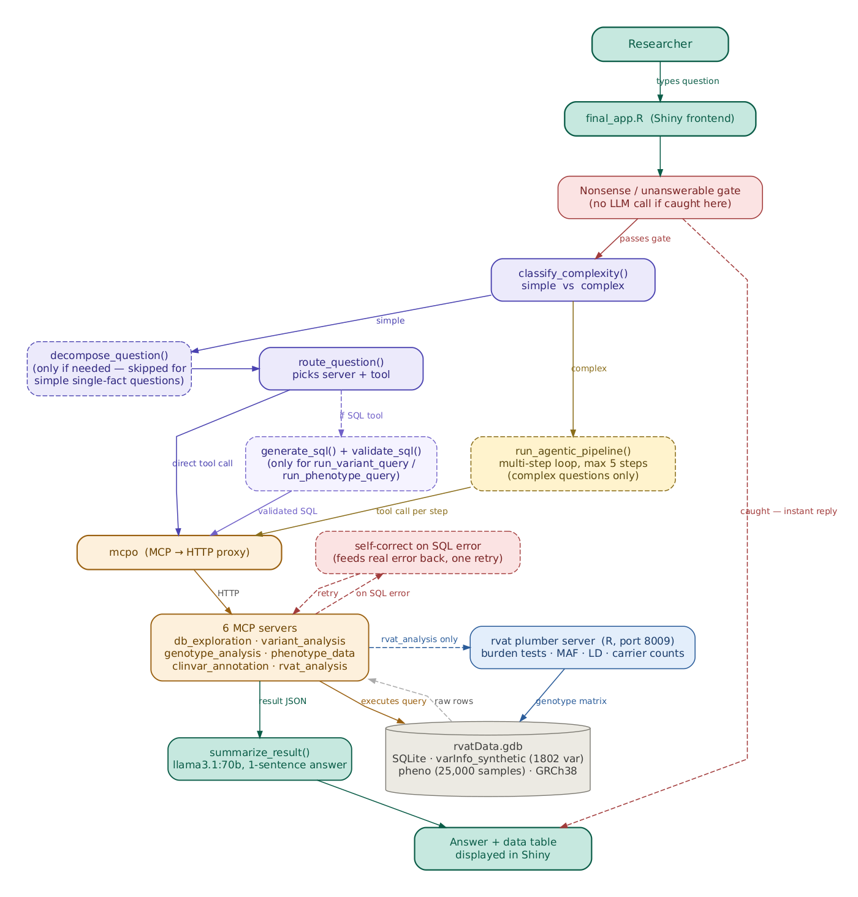

# Project MinE ALS — Variant Assistant (final_app)

**Authors:** Luuk Engels, Robin Jansen, Siard Groot

LLM-powered chatbot for querying the Project MinE ALS genomic variant database
(`rvatData.gdb`). A single researcher question is answered by an adaptive
pipeline — decompose, route, generate SQL, validate, self-correct — running
entirely on `llama3.1:70b`, calling out to six MCP tool servers (including a
bridge to a real R/rvat statistical server) as needed.

This is the **final, presentation-ready version** of the project. It
consolidates everything built and benchmarked in `agentic_surf/` into one
clean app: a single model, a single pipeline, and tools purpose-built to
cover the question types that benchmarking showed needed them.

---

## What changed from earlier versions

Earlier iterations of this project (see `MVP/` and `agentic_surf/`) explored
several architectures side by side: a single-LLM mode, a two-LLM mode with
a dedicated SQL specialist (`duckdb-nsql`), and an "adaptive" mode that
picked between sub-models per question. Across a 111-question benchmark
covering 9 question categories (simple lookups, multi-step analysis,
genomic statistics, phenotype joins, edge cases, and deliberately
unanswerable/nonsense questions), the simplified single-model architecture
consistently matched or outperformed every multi-model variant — and ran
faster, since there was no model-switching overhead on this CPU-only server.

**`final_app` keeps only what the benchmark data justified keeping:**

- One model throughout: `llama3.1:70b`
- One pipeline: decompose (when needed) → route → generate SQL → validate →
  execute → self-correct (on error) → summarize
- A complex-question path (`run_agentic_pipeline`) for multi-step questions
  that need more than one tool call
- Tools that were added specifically because benchmarking showed the model
  struggling to hand-write certain SQL patterns reliably (per-sample
  burden, per-gene case/control ratios, threshold-based carrier counts,
  CADD/PolyPhen correlation, above-average comparisons) — purpose-built
  endpoints instead of asking the model to construct fragile SQL every time

---

## Architecture



*(Diagram source: `diagrams/architecture_diagram.R`, built with DiagrammeR.
Regenerate after any pipeline change with
`Rscript diagrams/architecture_diagram.R` — requires `DiagrammeR`,
`DiagrammeRsvg`, and `rsvg`, already available on the SURF environment.)*

**In short:**

1. A **nonsense/unanswerable gate** catches obviously invalid or
   out-of-scope questions before any LLM call — instant reply, no cost.
2. **`classify_complexity()`** decides whether the question is a simple
   lookup or needs multi-step reasoning.
3. **Simple questions** go through `decompose_question()` (skipped for
   plain single-fact lookups), `route_question()` (picks the MCP server +
   tool), and — only if the chosen tool is `run_variant_query` or
   `run_phenotype_query` — `generate_sql()` + `validate_sql()`.
4. **Complex questions** go through `run_agentic_pipeline()`, a loop of up
   to 5 steps where the model can call multiple tools in sequence, with
   guidance to stop as soon as the question is genuinely answered rather
   than over-exploring.
5. All tool calls go through **mcpo**, which proxies six MCP servers over
   HTTP. One of them, `rvat_analysis`, bridges to a real R **rvat** package
   running on its own plumber HTTP server — used for proper statistical
   burden tests, MAF, LD, and cohort-wide carrier counts that aren't
   expressible as plain SQL.
6. If a generated SQL query fails at execution time, the pipeline feeds the
   **real database error** back to the model once and asks it to fix its
   own query — genuine feedback-driven correction, not a hardcoded rule.
7. **`summarize_result()`** turns the raw tool result into a one-sentence
   answer for the researcher.

---

## The dataset

**File:** `rvatData.gdb` (SQLite-based rvat genomic database)

### `varInfo_synthetic` — 1,802 variants across 12 genes

A synthetic 10-sample subset (5 ALS cases, 5 matched controls) used for
fast, self-contained variant-level queries.

| Column | Meaning |
|---|---|
| `VAR_id`, `CHROM`, `POS`, `ID`, `REF`, `ALT` | Variant identity and genomic position (`ID` is an rsID where known) |
| `AC`, `AN`, `AF` | Allele count, total alleles, global allele frequency |
| `gene_name` | One of 12 genes: ABCA4, RIN3, NEK1, IL3RA, PEX5, OPTN, ZNF483, FUS, CYP19A1, SOD1, UBQLN2, TARDBP |
| `HighImpact`, `ModerateImpact`, `Synonymous` | TEXT `'0'`/`'1'` impact flags (mutually exclusive — a variant cannot be both Synonymous and HighImpact) |
| `CADDphred` | CADD deleteriousness score (TEXT, `'.'` if missing; >20 generally considered deleterious) |
| `SIFT` | `'D'` deleterious, `'T'` tolerated, `'.'` missing |
| `PolyPhen` | `'D'` damaging, `'P'` possibly damaging, `'B'` benign, `'.'` missing |
| `ALS_1`..`ALS_5` | Genotype for 5 ALS patients: 0 = hom-ref, 1 = het, 2 = hom-alt |
| `Control_1`..`Control_5` | Genotype for 5 matched controls, same encoding |

### `pheno` — 25,000 samples (the real cohort)

Used for population/sex/age-filtered questions and for the rvat statistical
endpoints, which compute against the *full* cohort rather than the 10-sample
synthetic subset.

| Column | Meaning |
|---|---|
| `IID` | Sample ID. `ALS_1` in `varInfo_synthetic` corresponds to IID `'ALS1'` (no underscore) for the 10 synthetic samples; the other ~24,990 samples are part of the real cohort only |
| `sex` | 1 = female, 2 = male |
| `pheno` | 1 = ALS case, 0 = control |
| `pop` | Specific population code, e.g. `'PJL'`, `'BEB'`, `'GIH'` (many distinct values) |
| `superPop` | Continental/regional group: `'SAS'`, `'EUR'`, `'AFR'`, `'EAS'`, `'AMR'` (only 5 values — a region name like "SAS" always means `superPop`, never `pop`) |
| `age` | Sample age (present in `pheno`, not linked to genotype columns by name) |

### Important conventions baked into the prompts and SQL schema

- Missing values are stored as the string `'.'`, never SQL `NULL` —
  always filter with `!= '.'`, never `IS NOT NULL`.
- `HighImpact`/`ModerateImpact`/`Synonymous` are TEXT `'0'`/`'1'`, not
  booleans or integers.
- Genotype values are strictly `0`, `1`, or `2` — there is no genotype 3 in
  diploid data; a question asking about genotype 3 should correctly return
  zero results, not be silently "corrected" to a valid value.
- "Pathogenic" has no dedicated column. The pipeline consistently uses
  **high + moderate impact** as the standard genomics proxy — this
  convention is documented identically everywhere it's used (SQL schema,
  router rules, the rvat carrier-count tool) to avoid the model receiving
  contradictory definitions.
- "Deleterious"/"damaging" (PolyPhen) means strictly `PolyPhen='D'` unless
  the question explicitly says "possibly damaging" too.
- "How many variants does X carry" means `COUNT`, not `SUM` of genotype
  dosage — summing would double-count homozygous variants.

---

## MCP servers

### Python servers (via mcpo on port 8008)

| Server | Covers |
|---|---|
| `db_exploration` | Schema, table info, database limitations (what's *not* in the data) |
| `variant_analysis` | Variant-level SQL: counts, impact filters, CADD/SIFT/PolyPhen, allele frequency, gene summaries, CADD/PolyPhen correlation, above-average comparisons |
| `genotype_analysis` | Carrier and burden analysis: per-sample burden (single sample or all samples), threshold-based carrier counts, case/control dosage ratios with enrichment flags |
| `phenotype_data` | Multi-table joins between genotype columns and the `pheno` table — scoped to the 10-sample synthetic subset |
| `clinvar_annotation` | ClinVar lookup via rsID, with a local SQLite cache to avoid repeated NCBI calls |
| `rvat_analysis` | Bridge to the R/plumber rvat server — burden tests, MAF, LD, single-variant association, and carrier counts against the **full 25,000-sample cohort** |

### R/plumber server (port 8009)

| Endpoint | Description |
|---|---|
| `POST /run_burden_test` | Statistical burden test for one gene (Firth, SKAT, etc.) |
| `POST /run_burden_all_genes` | Burden test across all 12 genes, ranked by p-value |
| `POST /run_single_variant_test` | Per-variant association p-values |
| `POST /get_maf_by_impact` | MAF computed from the genotype matrix |
| `POST /get_ld_matrix` | Pairwise linkage disequilibrium (r²) |
| `POST /get_variant_summary` | Genotype count summaries |
| `POST /get_carrier_info` | Sample-level carrier info |
| `POST /get_carrier_count_filtered` | Unique carrier counts against the real 25,000-sample cohort, filterable by sex/population/case-control status |
| `GET /get_cohort_summary` | Cohort-wide sample counts and breakdowns |
| `GET /status` | Health check |

**Two carrier-counting tools exist on purpose** — `phenotype_data.get_carriers_with_phenotype`
covers the small synthetic subset for plain "female carriers in [gene]"
questions; `rvat_analysis.get_carrier_count_filtered` covers the real
cohort for questions that explicitly mention "pathogenic" or an impact
level. The router picks between them based on exact question wording —
see the `DISAMBIGUATION` block in `pipeline.R` if you need to adjust this.

---

## Requirements

### Software
- **R** ≥ 4.2 with packages: `shiny`, `bslib`, `DT`, `httr2`, `jsonlite`,
  `shinyjs`, `plumber`, `rvat`
- **Python** ≥ 3.10 in a conda env with: `mcp`, `mcpo`
- **Ollama**, run as its own system service (not part of the conda env —
  see note in `environment.yml`), with `llama3.1:70b` pulled

### Setup

```bash
# 1. Create the conda environment
conda env create -f environment.yml
conda activate mcp_env

# 2. Install Ollama separately (NOT via conda) and pull the model
curl -fsSL https://ollama.com/install.sh | sh
ollama pull llama3.1:70b

# 3. Install rvat (not available via standard conda channels)
R -e 'remotes::install_github("CenterForStatistics-UGent/rvat")'

# 4. Build the ClinVar cache (first time only, ~20 min)
#
#    IMPORTANT: rebuild this against whatever rvatData.gdb you're actually
#    using. The cache is keyed by the rsIDs present in varInfo_synthetic —
#    if you swap in a different/larger variant dataset, an old cache built
#    against the original 12-gene synthetic set will silently miss every
#    new rsID and return stale results for any rsID that no longer exists.
#    Only skip this step and copy an existing clinvar_cache.db if you are
#    knowingly continuing to use the SAME varInfo_synthetic table it was
#    built from.
cd mcp_servers
RVAT_GDB_PATH=~/project_ALS_databse/references/rvatData.gdb \
  python3 clinvar_annotation.py --build-cache
cd ..

# 5. Start all backend services (rvat plumber server + mcpo)
bash start_services.sh

# 6. Launch the app
R -e "shiny::runApp('final_app.R')"
```

`start_services.sh` auto-detects your conda installation and Python path,
generates `servers.json` automatically (no manual editing needed), and
checks that Ollama is reachable before starting anything else.

---

## File structure

```
final_app/
├── final_app.R                 ← Shiny frontend (chat UI, example questions, status panel)
├── pipeline.R                  ← All pipeline logic: routing, SQL generation, agentic loop,
│                                  self-correction, phase timing, summarization
├── prompts.txt                 ← Minimal extra instructions not already covered in pipeline.R
├── environment.yml             ← Conda environment (see notes inside re: Ollama and rvat)
├── start_services.sh           ← Starts rvat plumber server + mcpo, auto-generates servers.json
├── servers.json                ← Auto-generated by start_services.sh — do not edit by hand
├── diagrams/
│   ├── architecture_diagram.R  ← DiagrammeR source for the diagram above
│   └── architecture_diagram.png← Rendered diagram (regenerate after pipeline changes)
└── mcp_servers/
    ├── DB_exploration.py
    ├── variant_analysis.py
    ├── genotype_analysis.py
    ├── phenotype_data.py
    ├── clinvar_annotation.py
    ├── clinvar_cache.db        ← Local ClinVar cache — rebuild per dataset (see Setup step 4)
    ├── rvat_server.R           ← R/plumber rvat statistical server
    └── rvat_bridge.py          ← FastMCP bridge exposing rvat_server.R's endpoints to mcpo
```

---

## A note on `rvat_server.log`

`start_services.sh` redirects all rvat plumber server output to
`mcp_servers/../rvat_server.log` in this directory. This includes rvat's
own progress messages (e.g. genotype matrix loading for 25,000 samples) —
this is normal, rvat is verbose by design. Check this file first if the
rvat server seems unresponsive:

```bash
tail -f rvat_server.log
```

---

## Stopping services

```bash
# Stop mcpo
pkill -f "mcpo.*8008"

# Stop the rvat plumber server
fuser -k 8009/tcp
```